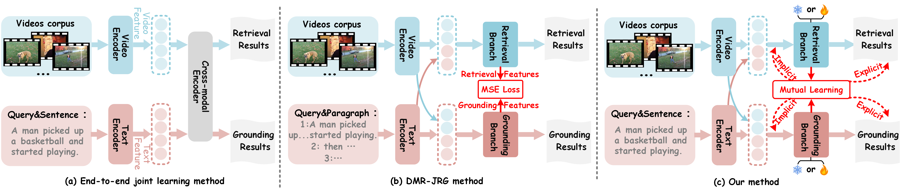
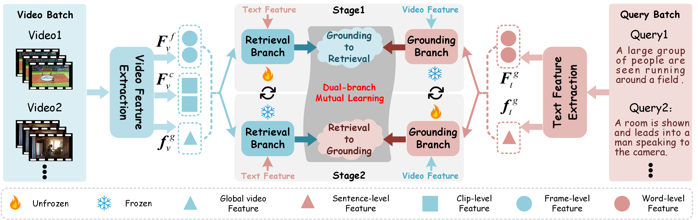

# 	Dual-Branch Collaborative Implicit-Explicit Mutual Learning for Weakly Supervised Video-Sentence Retrieval and Grounding

<div align="center">
    
</div>

Abstract:Video-Sentence Retrieval and Grounding (VSRG) task aims to retrieve the corresponding video from a video corpus based on a single sentence query and accurately localize the temporal boundary of the sentence within the video. However, employing an end-to-end joint optimization strategy faces a critical challenge in the VSRG task: a task  conflict exists between the retrieval and grounding tasks—the retrieval task focuses on global video-text matching, while the grounding task requires fine-grained alignment between a local video segment and the sentence query. To address this issue, we propose a Dual-Branch Collaborative Implicit-Explicit Mutual Learning framework (DCIML). The DCIML framework adopts a dual-branch structure, where the retrieval branch is responsible for cross-modal video-text retrieval, and the grounding branch achieves precise temporal grounding based on the sentence query. Furthermore, we employ an iterative optimization strategy to  train each task. Meanwhile, to promote collaborative optimization of the dual tasks, we design a dual-branch mutual learning module that facilitates cross-task knowledge transfer through bidirectional explicit and implicit pathways. The DCIML framework not only effectively resolves  the task conflict  between the retrieval and grounding tasks but also achieves collaborative optimization of the dual tasks. Experimental results demonstrate that DCIML performs excellently on the ActivityNet-Captions and Charades-STA datasets, validating its effectiveness.

## News
- :beers:  Our paper has been submitted to the TIP.

## Framework


## Main Results


#### Main results on ActivityNet Captions and Charades-STA


#### Main results on TACoS

<div align="center">
    
</div>


## Prerequisites
- python 3.5
- pytorch 1.4.0
- torchtext
- easydict
- terminaltables

## Training
Use the following commands for training:
```
cd moment_localization && export CUDA_VISIBLE_DEVICES=0
python dense_train.py --verbose --cfg ../experiments/dense_activitynet/acnet.yaml
```
## test
Use the following commands for test:
```
cd moment_localization && export CUDA_VISIBLE_DEVICES=0
python best_test.py --verbose --cfg ../experiments/dense_activitynet/acnet.yaml
```

We also provide several checkpoints for reproducing our experiment results. You can download them from [baidu drive](https://pan.baidu.com/s/1xWC90AIDImVJfKV9qcah4Q), put them under ```checkpoint/``` and use the above scripts to evaluate them.


## e-mail

call me: mengzhaowangg@163.com
